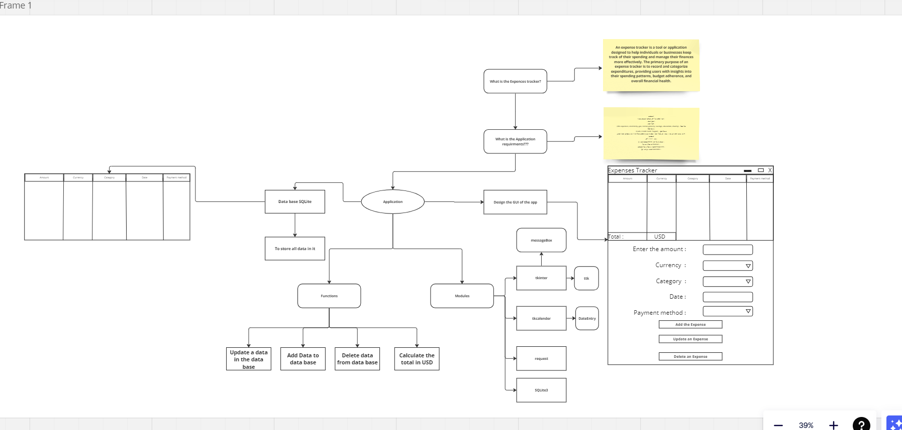

# 💰 Expenses Tracker



## 📝 الوصف
تطبيق سطح المكتب لتتبع المصروفات اليومية مع واجهة مستخدم رسومية سهلة الاستخدام. يمكنك إضافة، تعديل، وحذف المصروفات، وتحويل جميع المصروفات إلى الدولار الأمريكي، وتصدير البيانات إلى ملف CSV.

## ✨ المميزات
- ✅ إضافة مصروفات جديدة مع التفاصيل الكاملة
- 🗑️ حذف مصروفات محددة أو جميع المصروفات
- 📝 تعديل المصروفات الموجودة
- 💵 تحويل جميع المصروفات إلى الدولار الأمريكي
- 📊 تصدير البيانات إلى ملف CSV
- 💰 عرض إجمالي المصروفات
- 🎨 واجهة مستخدم جميلة وسهلة الاستخدام

## 🛠️ المتطلبات
```bash
python 3.x
tkinter
tkcalendar==1.6.1
requests==2.31.0
python-dotenv==1.0.0
```

## ⚙️ التثبيت والتشغيل

1. قم بإنشاء بيئة افتراضية:
```bash
python -m venv venv
```

2. قم بتفعيل البيئة الافتراضية:
- في Linux/Mac:
```bash
source venv/bin/activate
```
- في Windows:
```bash
venv\Scripts\activate
```

3. قم بتثبيت المكتبات المطلوبة:
```bash
pip install -r requirements.txt
```

4. قم بتشغيل التطبيق:
```bash
python ExpensesTracker_project.py
```

## 📱 كيفية الاستخدام

### إضافة مصروف جديد:
1. أدخل المبلغ في حقل "Amount"
2. اختر العملة من القائمة المنسدلة "Currency"
3. اختر الفئة من القائمة المنسدلة "Category"
4. اختر التاريخ من التقويم
5. اختر طريقة الدفع من القائمة المنسدلة "Payment Method"
6. اضغط على زر "Add Expense"

### حذف مصروف:
1. اختر المصروف من القائمة
2. اضغط على زر "Delete Expense"
3. أكد الحذف في النافذة المنبثقة

### تعديل مصروف:
1. اختر المصروف من القائمة
2. اضغط على زر "Update Expense"
3. قم بتعديل البيانات في النافذة الجديدة
4. اضغط على زر "Update Expense" للحفظ

### تحويل المصروفات إلى الدولار:
- اضغط على زر "Convert to USD"
- انتظر حتى تظهر النتيجة في نافذة منبثقة

### تصدير البيانات:
- اضغط على زر "Export to CSV"
- سيتم حفظ الملف في نفس مجلد التطبيق

## 🎯 الفئات المتاحة
- Life Expenses
- Electricity Bill
- Gas Bill
- Rental
- Grocery
- Savings
- Education
- Charity

## 💳 طرق الدفع المتاحة
- Credit Card
- Debit Card
- Transfer
- Paypal
- Cash

## 💱 العملات المدعومة
- USD (الدولار الأمريكي)
- EUR (اليورو)
- JPY (الين الياباني)
- GBP (الجنيه الإسترليني)
- AUD (الدولار الأسترالي)
- CAD (الدولار الكندي)
- CHF (الفرنك السويسري)
- CNY (اليوان الصيني)
- EGP (الجنيه المصري)
- وغيرها...

## 👨‍💻 المطور
- Eng. Yosef Zaher

## 📄 الترخيص
هذا المشروع مرخص تحت رخصة MIT.
